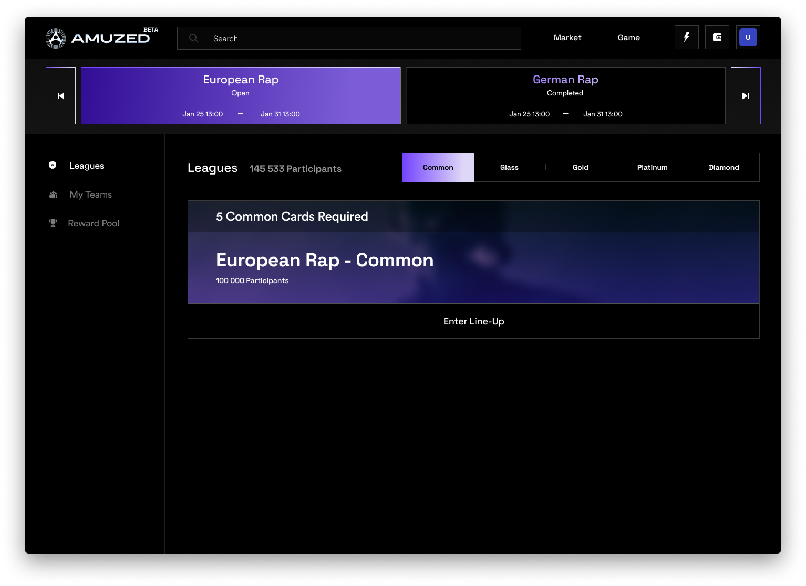

# Tournaments

The AMUZED Fantasy Game consists of a wide variety of weekly tournaments with different rules and specifications for the lineup that the user can enter.&#x20;

### **Duration & Start Time**

A standard tournament lasts for **6 days** (Friday 0:00 until Wednesday at 23:59pm). Over the course of these six days the performance of all of the artists are tracked and afterwards the respective final scores will be published. &#x20;


During the course of the 6 days, users will be able to see their daily "live score" per artist that is updated on an hourly basis, until the final score after the 6 days is published.&#x20;


Users will have to select their lineup until 11:59pm on Thursday (local time) in order to be eligible to play. The tournament starts on the first minute of Friday, taking "[New Music Release Fridays](https://en.wikipedia.org/wiki/Global\_Release\_Day)" into account.&#x20;

### Type of Tournaments

#### Standard Tournament

The standard tournament will be played every week and is the main attraction on the AMUZED platform. The standard tournament is called:

<mark style="background-color:green;">Global Artists</mark>

Has no additional requirements for lineups to participate. In this tournament, every artist from any geography, age, and genre can earn points for the user's lineup.&#x20;

#### Special Tournaments

In addition, there are also weekly special tournaments, that have extra requirements for the featured artists in the lineup. There can be multiple special tournaments per week and sometimes only the standard tournament will be available. This will be decided on a week by week basis by AMUZED. The requirements for these special tournaments can always be subject to change and will often change on a week by week basis. However, they will always be a combination of three categories of requirements:&#x20;

1. **Age**: The age of the artists that can be chosen for the lineup by the user
2. **Geography**: The country or region of the artists that can be chosen for the lineup by the user
3. **Genre**: The main genre of the artist that can be chosen for the lineup by the user

These tournaments can be easily identified by their icon. Initially there will be the following "Special Tournaments":&#x20;

<mark style="background-color:purple;">German Rap</mark>

Requirements:&#x20;

* Only German artist
* Only Rap artists

<mark style="background-color:purple;">European Rap</mark>

Requirements:&#x20;

* Only European artist (incl. UK)
* Only Rap artists

<mark style="background-color:purple;">Global Youngsters</mark>

* Only artists <= 25 years of age

#### Extra Tournament Requirements & Features

There are also additional requirements and features that can be added to special gameplay tournaments in the future:&#x20;

* **Gender**: Only artists with a specific gender can be selected to the lineup&#x20;
* **Only Social**: Tournament in which only the social media performance of artists count towards the score -> Music streaming data will be omitted from the score for this tournament
* **Duration**: Length of a tournament differs from the standard six days -> Shorter and longer tournaments possible
* **Lineup Size**: More or less than 5 artists
* **Increased Rewards**: Specific tournaments with a larger reward pool for participating users
* **Language**: Only artists that sing in a specific language can be selected to the lineup
* **Level**: Only tokens with a particular XP-Level (0-10) can be selected to the lineup
* **One Winner**: "Winner takes all" tournament in which the user with the best performing lineup receives the entirety of the reward pool

These additional requirements can be clearly identified quickly by the icon and the specifics of these can be seen in the respective tournament overview

#### Leagues

For every tournament there are 5 leagues (Common, Glass, Gold, Platinum, Diamond) that users can participate in - dependent on the type of tokens they own and can select to their weekly lineup. The requirements to enter one of the leagues is identical across all forms of tournaments and can be viewed [here](lineup.md#league-rarity-requirements).&#x20;

